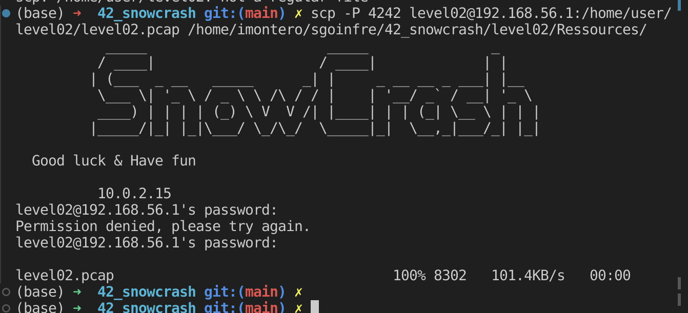

How to find:

There is a .pcap file named level02.pcap.

**pcap**

Packet CAPture. A pcap file is created by tools that caputre network packets (tcp, udp, etc) and monitors network. Tools such as Wireshark can do this. In a pcap file the whole monitored data is stored.

copy file to our machine:

    scp -P 4242 level02@192.168.56.1:/home/user/level02/level02.pcap /home/imontero/sgoinfre/42_snowcrash/level02/Ressources/

run a debian container and install wireshark

    docker run -it --name mycontainer debian bash
    apt update
    apt install tshark

copy file inside container

    (base) ➜  Ressources git:(main) ✗ docker cp /home/imontero/sgoinfre/42_snowcrash/level02/Ressources/level02.pcap mycontainer:/snowcrash/

    Successfully copied 10.2kB to mycontainer:/snowcrash/
    Error response from daemon: failed to Lchown "/snowcrash/level02.pcap" for UID 101927, GID 4223 (try increasing the number of subordinate IDs in /etc/subuid and /etc/subgid): lchown /snowcrash/level02.pcap: invalid argument
    (base) ➜  Ressources git:(main) ✗ 

run tshark on the file

    tshark -r level02.pcap
    tshark -r level02.pcap -Y 'frame contains "Password"' -V

    Running as user "root" and group "root". This could be dangerous.
    Frame 43: 79 bytes on wire (632 bits), 79 bytes captured (632 bits)
        Encapsulation type: Ethernet (1)
        Arrival Time: Jul 20, 2011 05:23:26.095219000 UTC
        [Time shift for this packet: 0.000000000 seconds]
        Epoch Time: 1311139406.095219000 seconds
        [Time delta from previous captured frame: 0.000096000 seconds]
        [Time delta from previous displayed frame: 0.000000000 seconds]
        [Time since reference or first frame: 13.827653000 seconds]
        Frame Number: 43
        Frame Length: 79 bytes (632 bits)
        Capture Length: 79 bytes (632 bits)
        [Frame is marked: False]
        [Frame is ignored: False]
        [Protocols in frame: eth:ethertype:ip:tcp:data]
    Ethernet II, Src: PcsCompu_cc:8a:1e (08:00:27:cc:8a:1e), Dst: Giga-Byt_0f:00:ad (00:24:1d:0f:00:ad)
        Destination: Giga-Byt_0f:00:ad (00:24:1d:0f:00:ad)
            Address: Giga-Byt_0f:00:ad (00:24:1d:0f:00:ad)
            .... ..0. .... .... .... .... = LG bit: Globally unique address (factory default)
            .... ...0 .... .... .... .... = IG bit: Individual address (unicast)
        Source: PcsCompu_cc:8a:1e (08:00:27:cc:8a:1e)
            Address: PcsCompu_cc:8a:1e (08:00:27:cc:8a:1e)
            .... ..0. .... .... .... .... = LG bit: Globally unique address (factory default)
            .... ...0 .... .... .... .... = IG bit: Individual address (unicast)
        Type: IPv4 (0x0800)
    Internet Protocol Version 4, Src: 59.233.235.223, Dst: 59.233.235.218
        0100 .... = Version: 4
        .... 0101 = Header Length: 20 bytes (5)
        Differentiated Services Field: 0x00 (DSCP: CS0, ECN: Not-ECT)
            0000 00.. = Differentiated Services Codepoint: Default (0)
            .... ..00 = Explicit Congestion Notification: Not ECN-Capable Transport (0)
        Total Length: 65
        Identification: 0xd4b3 (54451)
        010. .... = Flags: 0x2, Don't fragment
            0... .... = Reserved bit: Not set
            .1.. .... = Don't fragment: Set
            ..0. .... = More fragments: Not set
        ...0 0000 0000 0000 = Fragment Offset: 0
        Time to Live: 64
        Protocol: TCP (6)
        Header Checksum: 0x1677 [validation disabled]
        [Header checksum status: Unverified]
        Source Address: 59.233.235.223
        Destination Address: 59.233.235.218
    Transmission Control Protocol, Src Port: 12121, Dst Port: 39247, Seq: 215, Ack: 186, Len: 13
        Source Port: 12121
        Destination Port: 39247
        [Stream index: 0]
        [Conversation completeness: Incomplete, DATA (15)]
        [TCP Segment Len: 13]
        Sequence Number: 215    (relative sequence number)
        Sequence Number (raw): 3131636504
        [Next Sequence Number: 228    (relative sequence number)]
        Acknowledgment Number: 186    (relative ack number)
        Acknowledgment number (raw): 2635601275
        1000 .... = Header Length: 32 bytes (8)
        Flags: 0x018 (PSH, ACK)
            000. .... .... = Reserved: Not set
            ...0 .... .... = Accurate ECN: Not set
            .... 0... .... = Congestion Window Reduced: Not set
            .... .0.. .... = ECN-Echo: Not set
            .... ..0. .... = Urgent: Not set
            .... ...1 .... = Acknowledgment: Set
            .... .... 1... = Push: Set
            .... .... .0.. = Reset: Not set
            .... .... ..0. = Syn: Not set
            .... .... ...0 = Fin: Not set
            [TCP Flags: ???????AP???]
        Window: 453
        [Calculated window size: 14496]
        [Window size scaling factor: 32]
        Checksum: 0x279d [unverified]
        [Checksum Status: Unverified]
        Urgent Pointer: 0
        Options: (12 bytes), No-Operation (NOP), No-Operation (NOP), Timestamps
            TCP Option - No-Operation (NOP)
                Kind: No-Operation (1)
            TCP Option - No-Operation (NOP)
                Kind: No-Operation (1)
            TCP Option - Timestamps
                Kind: Time Stamp Option (8)
                Length: 10
                Timestamp value: 46283874: TSval 46283874, TSecr 18594183
                Timestamp echo reply: 18594183
        [Timestamps]
            [Time since first frame in this TCP stream: 13.827653000 seconds]
            [Time since previous frame in this TCP stream: 0.000096000 seconds]
        [SEQ/ACK analysis]
            [iRTT: 0.000390000 seconds]
            [Bytes in flight: 13]
            [Bytes sent since last PSH flag: 13]
        TCP payload (13 bytes)
    Data (13 bytes)

    0000  00 0d 0a 50 61 73 73 77 6f 72 64 3a 20            ...Password: 
        Data: 000d0a50617373776f72643a20
        [Length: 13]

get TCP stream number

    root@5a5fa97e0822:/snowcrash# tshark -r level02.pcap -Y 'frame.number == 43' -T fields -e tcp.stream
    Running as user "root" and group "root". This could be dangerous.
    0

follow stream 0 and save in a file

    tshark -r level02.pcap -q -z follow,tcp,hex,0

    Running as user "root" and group "root". This could be dangerous.

    ===================================================================
    Follow: tcp,hex
    Filter: tcp.stream eq 0
    Node 0: 59.233.235.218:39247
    Node 1: 59.233.235.223:12121
            00000000  ff fd 25                                          ..%
    00000000  ff fc 25                                          ..%
            00000003  ff fb 26 ff fd 18 ff fd  20 ff fd 23 ff fd 27 ff  ..&.....  ..#..'.
            00000013  fd 24                                             .$
    00000003  ff fe 26 ff fb 18 ff fb  20 ff fb 23 ff fb 27 ff  ..&.....  ..#..'.
    00000013  fc 24                                             .$
            00000015  ff fa 20 01 ff f0 ff fa  23 01 ff f0 ff fa 27 01  .. ..... #.....'.
            00000025  ff f0 ff fa 18 01 ff f0                           ........
    00000015  ff fa 20 00 33 38 34 30  30 2c 33 38 34 30 30 ff  .. .3840 0,38400.
    00000025  f0 ff fa 23 00 53 6f 64  61 43 61 6e 3a 30 ff f0  ...#.Sod aCan:0..
    00000035  ff fa 27 00 00 44 49 53  50 4c 41 59 01 53 6f 64  ..'..DIS PLAY.Sod
    00000045  61 43 61 6e 3a 30 ff f0  ff fa 18 00 78 74 65 72  aCan:0.. ....xter
    00000055  6d ff f0                                          m..
            0000002D  ff fb 03 ff fd 01 ff fd  22 ff fd 1f ff fb 05 ff  ........ ".......
            0000003D  fd 21                                             .!
    00000058  ff fd 03 ff fc 01 ff fb  22 ff fa 22 03 01 00 00  ........ ".."....
    00000068  03 62 03 04 02 0f 05 00  00 07 62 1c 08 02 04 09  .b...... ..b.....
    00000078  42 1a 0a 02 7f 0b 02 15  0f 02 11 10 02 13 11 02  B....... ........
    00000088  ff ff 12 02 ff ff ff f0  ff fb 1f ff fa 1f 00 b1  ........ ........
    00000098  00 31 ff f0 ff fd 05 ff  fb 21                    .1...... .!
            0000003F  ff fa 22 01 03 ff f0                              .."....
    000000A2  ff fa 22 01 07 ff f0                              .."....
            00000046  ff fa 21 03 ff f0 ff fb  01 ff fd 00 ff fe 22     ..!..... ......"
    000000A9  ff fd 01 ff fb 00 ff fc  22                       ........ "
            00000055  ff fa 22 03 03 e2 03 04  82 0f 07 e2 1c 08 82 04  .."..... ........
            00000065  09 c2 1a 0a 82 7f 0b 82  15 0f 82 11 10 82 13 11  ........ ........
            00000075  82 ff ff 12 82 ff ff ff  f0                       ........ .
            0000007E  0d 0a 4c 69 6e 75 78 20  32 2e 36 2e 33 38 2d 38  ..Linux  2.6.38-8
            0000008E  2d 67 65 6e 65 72 69 63  2d 70 61 65 20 28 3a 3a  -generic -pae (::
            0000009E  66 66 66 66 3a 31 30 2e  31 2e 31 2e 32 29 20 28  ffff:10. 1.1.2) (
            000000AE  70 74 73 2f 31 30 29 0d  0a 0a 01 00 77 77 77 62  pts/10). ....wwwb
            000000BE  75 67 73 20 6c 6f 67 69  6e 3a 20                 ugs logi n:
    000000B2  6c                                                l
            000000C9  00 6c                                             .l
    000000B3  65                                                e
            000000CB  00 65                                             .e
    000000B4  76                                                v
            000000CD  00 76                                             .v
    000000B5  65                                                e
            000000CF  00 65                                             .e
    000000B6  6c                                                l
            000000D1  00 6c                                             .l
    000000B7  58                                                X
            000000D3  00 58                                             .X
    000000B8  0d                                                .
            000000D5  01                                                .
            000000D6  00 0d 0a 50 61 73 73 77  6f 72 64 3a 20           ...Passw ord:
    000000B9  66                                                f
    000000BA  74                                                t
    000000BB  5f                                                _
    000000BC  77                                                w
    000000BD  61                                                a
    000000BE  6e                                                n
    000000BF  64                                                d
    000000C0  72                                                r
    000000C1  7f                                                .
    000000C2  7f                                                .
    000000C3  7f                                                .
    000000C4  4e                                                N
    000000C5  44                                                D
    000000C6  52                                                R
    000000C7  65                                                e
    000000C8  6c                                                l
    000000C9  7f                                                .
    000000CA  4c                                                L
    000000CB  30                                                0
    000000CC  4c                                                L
    000000CD  0d                                                .
            000000E3  00 0d 0a                                          ...
            000000E6  01                                                .
            000000E7  00 0d 0a 4c 6f 67 69 6e  20 69 6e 63 6f 72 72 65  ...Login  incorre
            000000F7  63 74 0d 0a 77 77 77 62  75 67 73 20 6c 6f 67 69  ct..wwwb ugs logi
            00000107  6e 3a 20                                          n:
    ===================================================================

(translated in ASCII)
66 74 5f 77 61 6e 64 72 ->  **ft_wandr**
7f 7f 7f -> **Delete x3 times**
4e 44 52 65 6c -> **NDRel**
7f -> **Delete**
4c 30 4c -> **L0L**
0d -> **Enter**

### ft_waNDReL0L

    level02@SnowCrash:~$ su flag02
    Password: 
    Don't forget to launch getflag !
    flag02@SnowCrash:~$ getflag
    Check flag.Here is your token : kooda2puivaav1idi4f57q8iq

